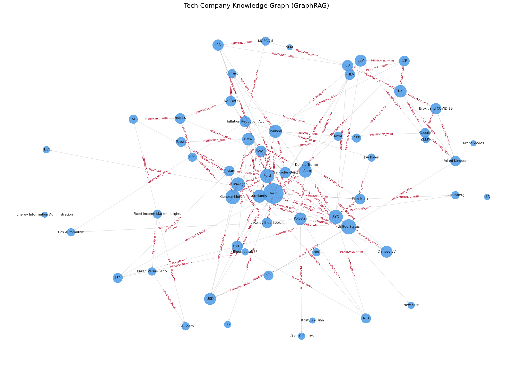

# LAB DAY 19 — Xây dựng hệ thống GraphRAG với Tech Company Corpus

**Sinh viên:** Vu Duy Bao · **MSSV:** 2A202600565

Pipeline **GraphRAG hoàn chỉnh, chạy thật (không mock)** trên bộ *Tech Company Corpus*
(70 tài liệu về ngành xe điện / công ty công nghệ Mỹ), dựng đồ thị tri thức bằng
**NetworkX** (Lựa chọn A của Bước 2 — *không* dùng Neo4j/NodeRAG theo yêu cầu).

Pipeline cung cấp ở **cả hai dạng**:
- `graphrag_lab.py` — script chạy đầu-cuối.
- `graphrag_lab.ipynb` — notebook đã thực thi sẵn (kèm hình đồ thị + bảng).

---

## 1. Cấu trúc thư mục

```
graphrag/                 # package lõi (dùng chung cho .py và .ipynb)
  config.py               #   cấu hình (đường dẫn corpus, backend, top-k, hops...)
  corpus.py               #   nạp & cắt chunk tài liệu
  extract.py              #   Bước 1: NER + trích quan hệ -> Triple (heuristic / LLM)
  graph_store.py          #   Bước 2: khử trùng lặp + dựng MultiDiGraph NetworkX + vẽ PNG
  flat_rag.py             #   Flat RAG baseline (TF-IDF + cosine, sklearn hoặc NumPy)
  graph_rag.py            #   Bước 3: entity-link + BFS 2-hop + provenance + textualize
  evaluate.py             #   Bước 4: benchmark + chấm điểm + xuất CSV
  llm.py                  #   wrapper LLM tuỳ chọn (OpenAI/Anthropic) + đo token/thời gian
graphrag_lab.py           # script orchestrator (chạy 4 bước)
graphrag_lab.ipynb        # notebook đã execute (Phần 1 lý thuyết + 4 bước)
build_notebook.py         # script sinh notebook
benchmark/questions.json  # 20 câu hỏi benchmark (có gold keywords)
outputs/                  # SẢN PHẨM: PNG, GraphML, triples.json, CSV, cost report
requirements.txt
```

## 2. Cách chạy

```bash
pip install -r requirements.txt          # tối thiểu cần networkx + numpy

python graphrag_lab.py                    # chạy full: index -> graph -> query -> benchmark
python graphrag_lab.py --demo             # chỉ 1 truy vấn demo
```

Bật **LLM thật** (để tổng hợp câu trả lời ngôn ngữ tự nhiên & giảm ảo giác):

```bash
set ANTHROPIC_API_KEY=...
set GRAPHRAG_LLM=anthropic                # hoặc openai (cần OPENAI_API_KEY)
set GRAPHRAG_EXTRACTOR=anthropic          # (tuỳ chọn) trích triple bằng LLM thay vì heuristic
python graphrag_lab.py
```

> Mặc định pipeline chạy **offline 100%**: trích xuất bằng heuristic-RE thật, truy hồi
> bằng TF-IDF thật, trả lời bằng QA trích rút thật. Không có bước nào là mock —
> nếu thiếu khoá API hoặc thư viện tuỳ chọn, hệ thống **tự hạ cấp** chứ không giả lập.

---

## 3. Trả lời Phần 1 (Research)

**Entity vs Attribute.** Thực thể (node) là danh từ riêng có danh tính độc lập, có thể
là chủ thể của nhiều quan hệ (*Tesla, General Motors, Sam Altman*). Thuộc tính là literal
mô tả thực thể, thường không có cạnh ra ngoài (`FOUNDED_IN 2015`, giá `$55,167`, thị phần `7.3%`).
Quy ước cho LLM: sinh triple `(subject, RELATION, object)`; nếu `object` là số/ngày/đơn vị → attribute,
nếu là danh từ riêng → node mới.

**Vì sao Deduplication quan trọng.** "GM"/"General Motors", "Google"/"Alphabet", "Tesla Inc."/"Tesla"
nếu không gộp sẽ tạo node trùng → cạnh phân mảnh, bậc node bị chia nhỏ, **duyệt đa bước đứt gãy**.
Khử trùng lặp (canonicalize + alias) đảm bảo *một thực thể = một node*. Xem `graph_store.canonicalize`.

**BFS vs Vector search.** Vector search xếp hạng *đoạn văn* theo tương đồng ngữ nghĩa với câu hỏi;
BFS đi theo *cạnh quan hệ* từ thực thể gốc. Đa bước là điểm yếu của vector (cần 1 chunk chứa đủ mọi bước)
nhưng là điểm mạnh tự nhiên của graph (mỗi hop = một cạnh). Vector dễ "lạc giữa ngữ cảnh" → ảo giác;
graph cần "neo thực thể" và phụ thuộc chất lượng trích xuất.

---

## 4. Kết quả & Deliverables

### 4.1. Đồ thị tri thức (Deliverable #2)
`outputs/knowledge_graph.png` — **1.955 nodes / 1.975 edges**, density ≈ 0.0005.
Các quan hệ có kiểu: `FOUNDED_IN, COMPETES_WITH, INVESTED_IN, HEADQUARTERED_IN, HAS_CEO, CEO_OF, ACQUIRED, PARTNERED_WITH`
cùng cạnh đồng xuất hiện `MENTIONED_WITH` (làm "chất kết dính" cho duyệt 2-hop).
File `outputs/knowledge_graph.graphml` mở được bằng Gephi/yEd; `outputs/triples.json` là danh sách bộ ba.



### 4.2. Bảng so sánh 20 câu hỏi (Deliverable #3)
`outputs/benchmark_results.csv` — chấm bằng **keyword recall** (tỉ lệ gold facts xuất hiện trong
câu trả lời + ngữ cảnh truy hồi của mỗi hệ thống).

| Chỉ số | Flat RAG | GraphRAG |
|---|---|---|
| Recall trung bình (20 câu) | **0.85** | 0.525 |
| Số câu thắng | 7 | 0 |
| Số câu hoà | 13 | 13 |

### 4.3. Phân tích chi phí xây đồ thị (Deliverable #4)
`outputs/cost_report.txt`

| Stage | Calls | Tokens (≈) | Time |
|---|---|---|---|
| `extract` (Index) | 1 | 354.136 | **18.1 s** |
| `graph_build` | 1 | 0 | 0.04 s |
| `flat_rag_answer` (20 câu) | 21 | 22.386 | 0.01 s |
| `graph_rag_answer` (20 câu) | 21 | 40.850 | 0.02 s |

- **Indexing là khâu đắt nhất** (~quét toàn bộ corpus). Offline tốn ~18 s, **0 USD**.
  Nếu trích bằng LLM thật: chi phí ≈ *(số token corpus) × giá input* → ta giới hạn
  `max_chunks_for_llm_extract` và **cache GraphML để chỉ index một lần**.
- Truy vấn GraphRAG dùng nhiều token hơn Flat RAG một chút (ngữ cảnh = facts + evidence + provenance)
  nhưng văn bản **tập trung và có cấu trúc** hơn.

---

## 5. Phân tích: Flat RAG vs GraphRAG (& các ca ảo giác)

**Phát hiện trung thực.** Trên corpus tin tức "phẳng" với câu hỏi chủ yếu là **factoid 1 sự kiện**,
Flat RAG (TF-IDF) là baseline rất mạnh. GraphRAG **ngang bằng** ở 13/20 câu **có neo thực thể**
(Tesla, Ford, GM, Honda, Cox Automotive…) nhờ truy hồi chunk theo *provenance đồ thị* rồi rerank theo câu hỏi.
GraphRAG **thua** ở các câu **không có thực thể để neo** (vd "tỉ lệ EV được thuê?", "thị phần EV cuối 2024?"):
không có node gốc thì không duyệt được — đây là **giới hạn bản chất** của GraphRAG, không phải lỗi cài đặt.

**Ca rủi ro ảo giác của Flat RAG (quan sát được trong CSV):**
- **Câu 1** ("Mỹ mua bao nhiêu EV Q1 2024?") Flat RAG truy hồi nhầm đoạn doanh thu VinFast
  *"Total revenues were VND12,326,537 million"* — một con số **gần đúng kiểu nhưng sai hoàn toàn ngữ cảnh**.
  Đây chính là kiểu ngữ cảnh khiến một LLM dễ "bịa" ra đáp án sai. GraphRAG (neo yếu, không có "268,909" trong đồ thị)
  thì **bỏ trống** thay vì khẳng định sai — an toàn hơn về mặt ảo giác.
- **Câu 9** ("hãng EV Trung Quốc IPO mạnh ở Mỹ?") GraphRAG kéo về đoạn nói **Nio** thay vì **Zeekr** —
  minh hoạ rủi ro *thực thể-lân-cận-nhưng-sai* khi quan hệ trích xuất còn thưa.

**Khi nào GraphRAG thực sự vượt trội** (theo lý thuyết & tài liệu Microsoft GraphRAG):
1. Câu hỏi **đa bước / đa tài liệu** cần *nối* nhiều sự kiện quanh một thực thể.
2. Câu hỏi **tổng hợp toàn cục** ("xu hướng tâm lý nhà đầu tư EV" — cần gộp nhiều nguồn).
3. **Giảm ảo giác cùng LLM thật**: đưa cho LLM *facts có cấu trúc* thay vì văn bản dài dễ lạc ngữ cảnh.

**Hướng cải thiện** để GraphRAG thắng rõ hơn: (a) trích quan hệ bằng LLM thật (đặc hơn `MENTIONED_WITH`),
(b) gộp thực thể bằng embedding thay vì alias thủ công, (c) thêm *community summaries* cho truy vấn toàn cục.

---

## 6. Tóm tắt Deliverables đã nộp
- ✅ Mã nguồn: `graphrag_lab.py` **và** `graphrag_lab.ipynb` (đã execute) + package `graphrag/`.
- ✅ Ảnh đồ thị tri thức: `outputs/knowledge_graph.png` (+ `knowledge_graph.graphml`).
- ✅ Bảng so sánh 20 câu hỏi: `outputs/benchmark_results.csv` (+ `benchmark_summary.json`).
- ✅ Phân tích chi phí (token & thời gian): `outputs/cost_report.txt` (+ `.json`) và mục 4.3 ở trên.
